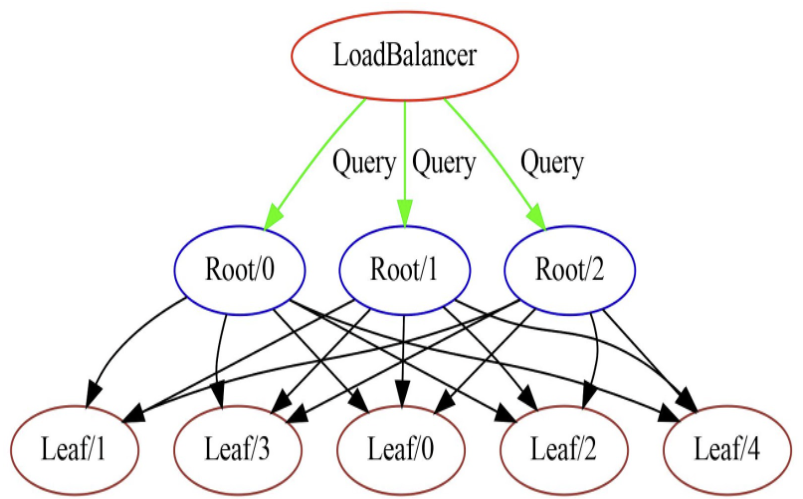
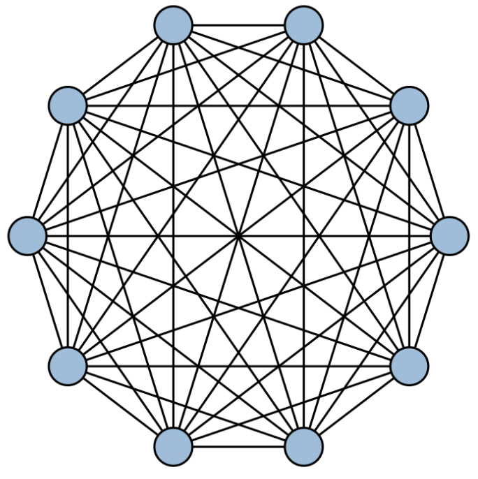

# Distbench Test Workloads

## Simple client server

This is the simplest workload for Distbench. A client performs a request to a
server which returns a response.


### Implementation

First two services are implemented and named client and server.
```yaml
tests {
  services {
    server_type: "client"
    count: $CLIENT_COUNT
  }
  services {
    server_type: "server"
    count: $SERVER_COUNT
  }
```

Then an action list is defined for the client, the name matches the service we
defined earlier. It will define what the actions for client are, when the test
start. In that case it will run the action `run_queries`.
```yaml
  action_lists {
    name: "client"
    action_names: "run_queries"
  }
```

The action is then defined as follows, in this case `run_queries` will perform
the `client_server_rpc` rpc 100 times:
```yaml
  action_table {
    name: "run_queries"
    rpc_name: "client_server_rpc"
    iterations {
      max_iteration_count: 100
    }
  }
```

The `client_server_rpc` is defined as follows, the RPC is done from the client
to the server. The request is defined has having 196B of payload and the
response will cary 256kB.
```yaml
  rpc_descriptions {
    name: "client_server_rpc"
    client: "client"
    server: "server"
    request_payload_name: "request_payload"
    response_payload_name: "response_payload"
  }
  payload_descriptions {
    name: "request_payload"
    size: 196
  }
  payload_descriptions {
    name: "response_payload"
    size: 262144
  }
```

Finally, the action performed when the `client_server_rpc` request is received
by the server is defined. In this case, no extra processing is performed, so
there is no action to perform. The response to the RPC is implied.
```yaml
  action_lists {
    name: "client_server_rpc"
    # No action on the server; just send the response
  }
}
```

### Running the test

To run the test, a `test_sequencer` with two node managers are required.

```bash
#(On 1 server node)
bazel run :distbench -c opt -- test_sequencer --port=10000 &
bazel run :distbench -c opt -- node_manager --test_sequencer=localhost:10000 --port=9999 &

#(On another server node)
bazel run :distbench -c opt -- node_manager --test_sequencer=localhost:10000 --port=9999 &

#(On the client)
./client_server_rpc_pattern.sh -s first_server_hostname:10000 -c 1 -i 1
```

Alternatively to simply run on localhost:
```bash
~/distbench$ ./start_distbench_localhost.sh -n 2
# CTRL-Z
~/distbench$ bg
~/distbench$ cd workloads
~/distbench/workloads$ ./simple_client_server_rpc_pattern.sh
```
The test should take a couple of seconds to run and you will obtain the
following output:

```yaml
connecting to localhost:10000
test_results {
  traffic_config {
    services {
      server_type: "client"
      count: 1
    }
    services {
      server_type: "server"
      count: 1
    }
    payload_descriptions {
      name: "request_payload"
      size: 196
    }
    payload_descriptions {
      name: "response_payload"
      size: 262144
    }
    rpc_descriptions {
      name: "client_server_rpc"
      client: "client"
      server: "server"
      request_payload_name: "request_payload"
      response_payload_name: "response_payload"
    }
    action_table {
      name: "run_queries"
      iterations {
        max_iteration_count: 100
      }
      rpc_name: "client_server_rpc"
    }
    action_lists {
      name: "client"
      action_names: "run_queries"
    }
    action_lists {
      name: "client_server_rpc"
    }
  }
  placement {
    service_endpoints {
      key: "client/0"
      value {
        endpoint_address: "[0000::0001:0002:0003:0004%eth0]:1118"
        hostname: "host1"
      }
    }
    service_endpoints {
      key: "server/0"
      value {
        endpoint_address: "[0000::0001:0002:0003:0004%eth0]:1094"
        hostname: "host1"
      }
    }
  }
  service_logs {
    instance_logs {
      key: "client/0"
      value {
        peer_logs {
          key: "server/0"
          value {
            rpc_logs {
              key: 0
              value {
                successful_rpc_samples {
                  request_size: 16
                  response_size: 0
                  start_timestamp_ns: 1622744047420305230
                  latency_ns: 721934
                }
                # x100
              }
            }
          }
        }
      }
    }
  }
  log_summary: "RPC latency summary:\nclient_server_rpc: N: 100 min: 66648ns median: 78499ns 90%: 139984ns 99%: 721934ns 99.9%: 721934ns max: 721934ns\n"
}
```

### Interpreting the results

The results contain 4 sections:
1. `traffic_config`: the configuration of the traffic pattern specified (see the
   Implementation section).
2. `placement`: the description of the service placement on the different
   Distbench `node_manager`.
3. `service_logs`: a long of the different RPC performed during the test, with
   their sizes, timestamps, etc. As we specified 100 iterations, we have 100
   `successful_rpc_samples` in this section.
4. `log_summary`: A concise summary of the RPC performance

In our case the summary is as follows:
```
  log_summary: "RPC latency summary:
  client_server_rpc: N: 100 min: 66648ns median: 78499ns 90%: 139984ns 99%: 721934ns 99.9%: 721934ns max: 721934ns
"
```

Indicating that 100 rpc was performed (N) with a median latency of 78.5us.

## Multi-level RPC pattern

For this pattern,
1. a load balancer distributes queries to a serie of root servers.
2. the root servers will then gather partial results from all the leaf nodes and
   waits for those results.
3. once all the responses are received, the original RPC response is sent to the
   load balancer.



### Implementation

See `multi_level_rpc_pattern.sh` for the details.

```yaml
  rpc_descriptions {
    name: "root_query"
    client: "load_balancer"
    server: "root"
    fanout_filter: "round_robin"
    tracing_interval: 2
  }
```
The `load_balancer` will distribute the requests in a `round_robin` fashion.

When the `root_query` is received by the root server, it then distribute the
queries across all the leaf servers (`fanout_filter: all`):

```yaml
  action_lists {
    name: "root_query"
    action_names: "root/root_query_fanout"
  }
  action_table {
    name: "root/root_query_fanout"
    rpc_name: "leaf_query"
  }
  rpc_descriptions {
    name: "leaf_query"
    client: "root"
    server: "leaf"
    fanout_filter: "all"
    tracing_interval: 2
  }
```

### Running

```bash
~/distbench$ ./start_distbench_localhost.sh -n 6
# CTRL-Z
~/distbench$ bg
~/distbench$ cd workloads
~/distbench/workloads$ ./multi_level_rpc_pattern.sh
```

## Clique RPC pattern

The Clique pattern involves a number of nodes needing to exchange some state at
every step.

- Periodically (every few milliseconds), an all-to-all exchange of messages is
  performed.
- This is done by pairwise exchanges (i.e. all the nodes send a small message to
  all the other nodes). All those exchanges need to complete as soon as
  possible.

As the number of nodes grow, this test becomes a challange for the RPC layer.

We target around 100 nodes for this benchmark.



### Implementation

```yaml
  action_table {
    name: "clique_queries"
    iterations {
      max_duration_us: 10000000
      open_loop_interval_ns: 16000000
      open_loop_interval_distribution: "sync_burst"
    }
    rpc_name: "clique_query"
  }
  rpc_descriptions {
    name: "clique_query"
    client: "clique"
    server: "clique"
    fanout_filter: "all"
  }
```

The `clique_query` is run every 16 ms (`open_loop_interval_ns`) in a synchronous
fashion (`sync_burst`). The test will run for 10s (`max_duration_us`).

Each clique service will send the `clique_query` (`fanout_filter: "all"`).

### Running

```bash
~/distbench$ ./start_distbench_localhost.sh -n 10
# CTRL-Z
~/distbench$ bg
~/distbench$ cd workloads
~/distbench/workloads$ ./clique_rpc_pattern.sh -n 10
```

Expected output:
```
  log_summary: "RPC latency summary:
    clique_query: N: 56250 min: 209506ns median: 708897ns 90%: 1273052ns 99%: 1626084ns 99.9%: 2297228ns max: 5399917ns
  "
}
Rpc succeeded with OK status
```

We have 56250 RPCs (The test run for 625 cycles -10000/16- and there is 10\*9
RPCs per cycle)
