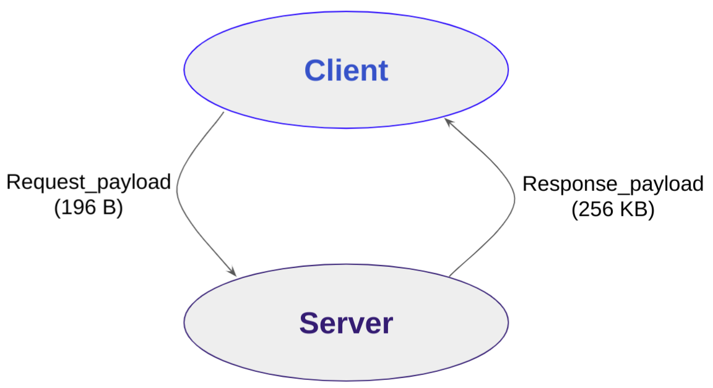

# Distbench Test Workloads

## Simple client server

This is the simplest workload for Distbench. A client performs a request to a
server which returns a response.



### Implementation

First two services are implemented and named client and server.
```
tests {
  services {
    server_type: "client"
    count: $CLIENT_COUNT
  }
  services {
    server_type: "server"
    count: $SERVER_COUNT
  }
```

Then an action list is defined for the client, the name matches the service we
defined earlier. It will define what the actions for client are, when the test
start. In that case it will run the action `run_queries`.
```
  action_list_table {
    name: "client"
    action_names: "run_queries"
  }
```

The action is then defined as follows, in this case `run_queries` will perform
the `client_server_rpc` rpc 100 times:
```
  action_table {
    name: "run_queries"
    rpc_name: "client_server_rpc"
    iterations {
      max_iteration_count: 100
    }
  }
```

The `client_server_rpc` is defined as follows, the RPC is done from the client
to the server. The request is defined has having 196B of payload and the
response will cary 256kB.
```
  rpc_descriptions {
    name: "client_server_rpc"
    client: "client"
    server: "server"
    request_payload_name: "request_payload"
    response_payload_name: "response_payload"
  }
  payload_descriptions {
    name: "request_payload"
    size: 196
  }
  payload_descriptions {
    name: "response_payload"
    size: 262144
  }
```

Finally, the action performed when the `client_server_rpc` request is received
by the server is defined. In this case, no extra processing is performed, so
there is no action to perform. The response to the RPC is implied.
```
  action_list_table {
    name: "client_server_rpc"
    # No action on the server; just send the response
  }
}
```

### Running the test


### Interpreting the results

## Multi-level RPC pattern

For this pattern, a load balancer distributes queries to root servers. The root
servers will then query partial results to all the leaf nodes and waits for
those result before being able to send the response to the load balancer for the
original query.


## Clique RPC pattern

The Clique pattern involves a number of nodes needing to exchange some state at
every step.

- Periodically (every few milliseconds), an all-to-all exchange of messages is
  performed.
- This is done by pairwise exchanges (i.e. all the nodes send a small message to
  all the other nodes). All those exchanges need to complete as soon as
  possible.

As the number of nodes grow, this test becomes a challange for the RPC layer.

We target around 100 nodes for this benchmark.


